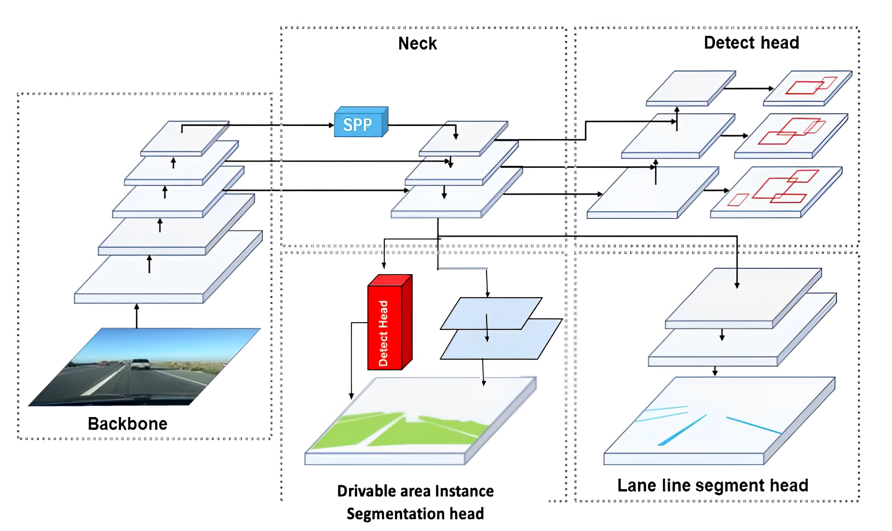

  

# Multitask Learning of Driving Data

## Objective 
- This objective of this project is to improve the performance of <b>Instance Segmentation of Drivable Area</b>.  
- Simply put, this model is able to detect the drivable area avaialble to a vehcile and differentiate between the area of the direct lane vs the alternative lane. 
- This computer vision project would be useful for autonomous vehicles while navigating on the road and making decisions for switching lanes.

## Introduction
 This project is an extension of the [YOLOP](https://github.com/hustvl/YOLOP) network, wherein the network has been modified to include Instance Segmentation of the Drivable Area instead of Semantic Segmentation.

### Network Architecture 

### Contributions
- The original YOLOP network has been modified to add an Instance Segmentation branch
- One of the heads that originally performed Semantic Segmentation of the Drivable Area now performs Instance Segmentation of Drivable Area
- The Instance Segmentation method was inspiried from the [YOLOACT](arXiv:1904.02689 ) paper
- For the Detection head, the original YOLOP performed detection on vehicles, however this project has the provision to perform detection on the Lane Lines as well
- Detection and Semantic Segmentation of the Lane Line was performed to capture information about the lane attributes (as in if it is a dashed white line, solid yellow line etc)